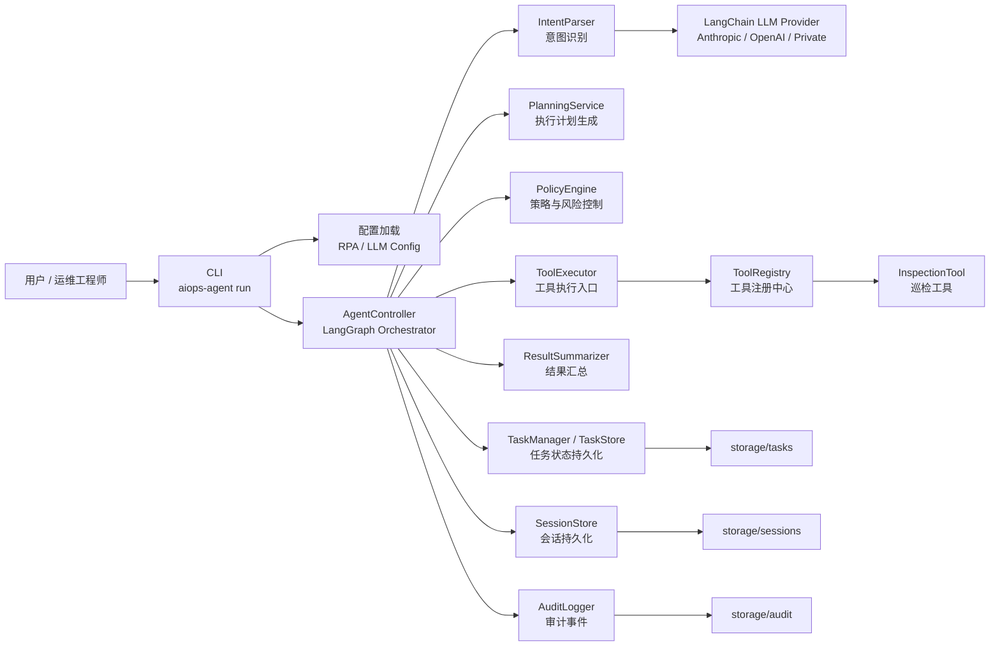
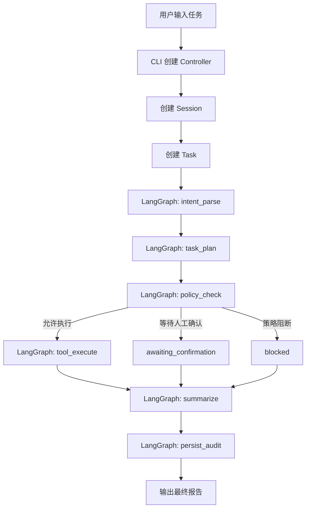
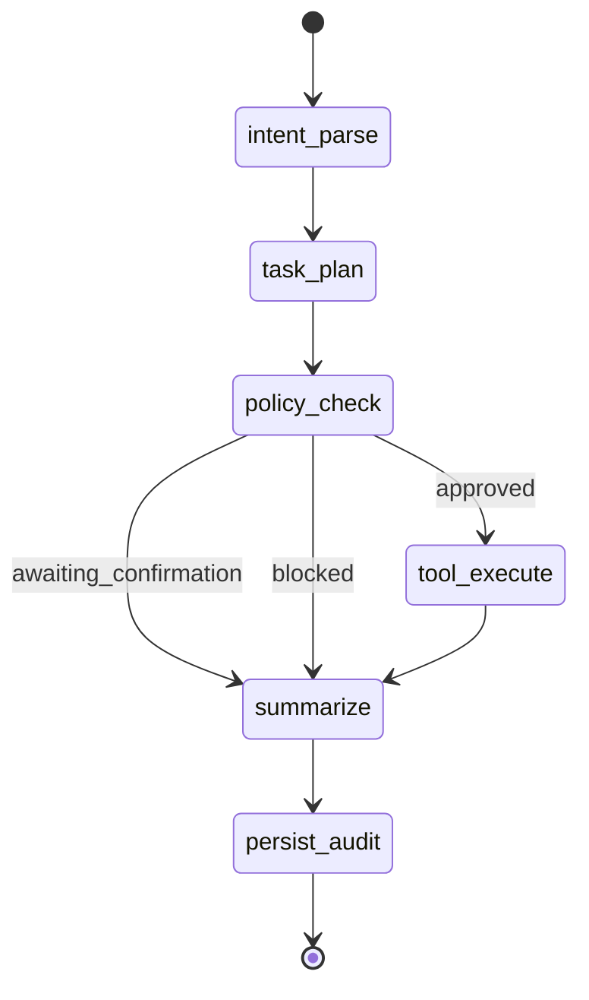
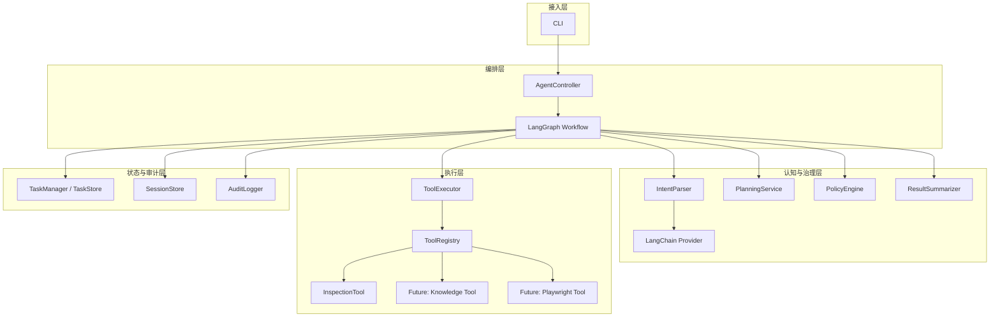
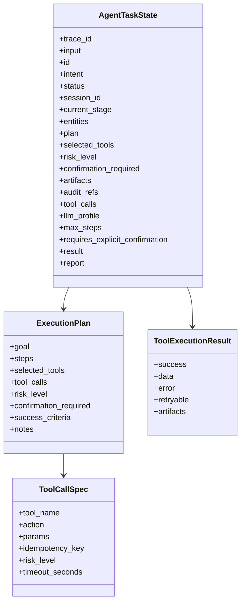
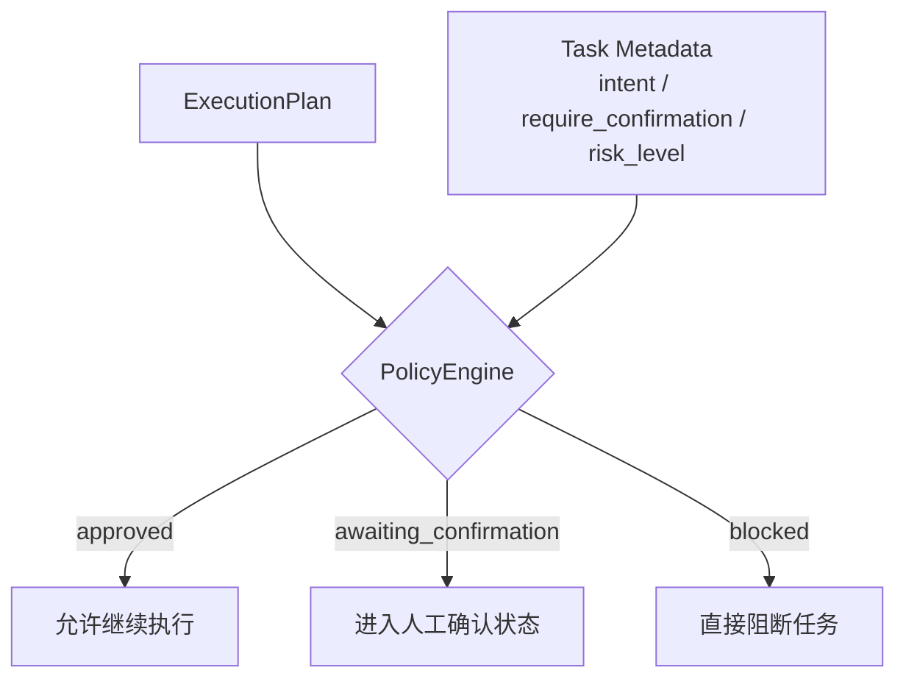
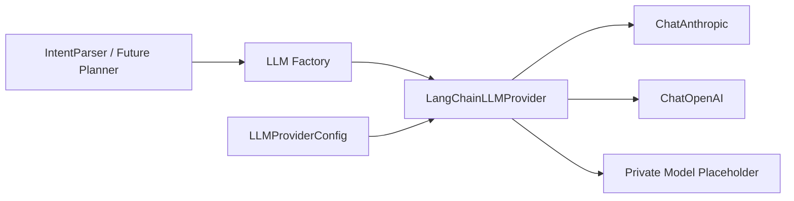
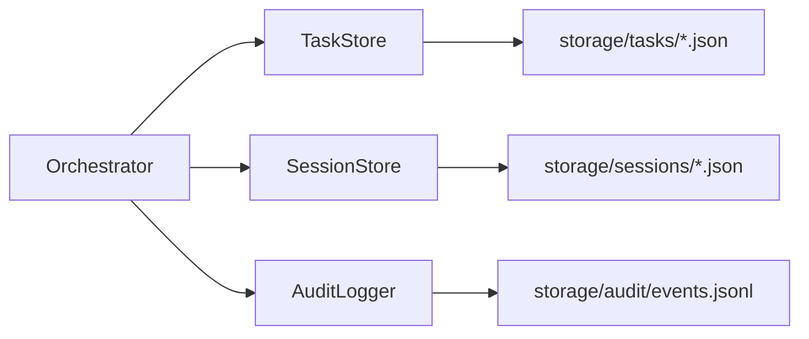
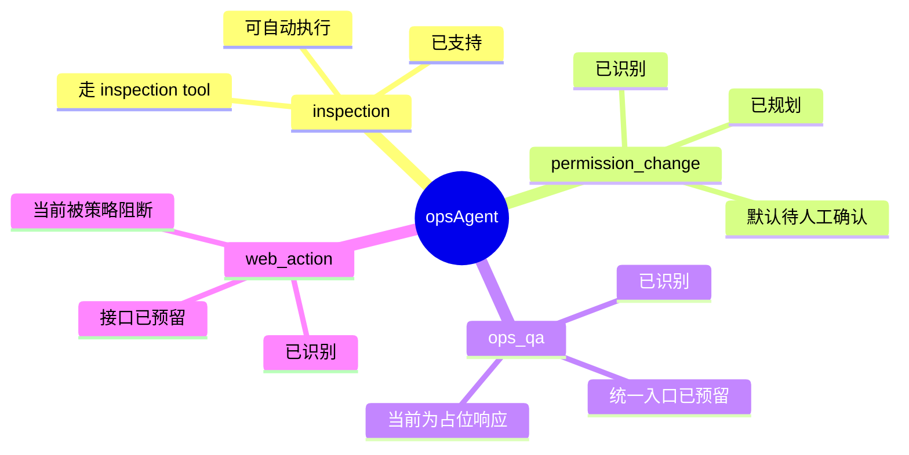
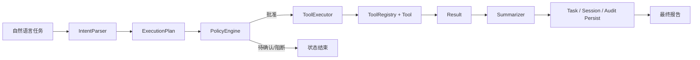

# opsAgent 架构导图

这份文档的目标不是逐文件解释代码，而是把 `opsAgent` 的整体设计串成一条主线，让你能快速回答这几个问题：

- 系统是怎么跑起来的
- 每一层分别负责什么
- 数据在系统里怎么流动
- 为什么当前这个设计比最初 MVP 更像企业级 AIOps 内核
- 现在的亮点是什么，后续扩展点又在哪里

---

## 1. 一句话理解系统

`opsAgent` 现在可以理解为一个“受控的 AIOps 编排内核”：

- 用户从 CLI 输入自然语言任务
- 系统先识别任务意图
- 再生成结构化执行计划
- 然后通过策略层判断能不能执行、是否需要人工确认
- 如果允许，就调度具体工具
- 最后把结果、审计、会话状态统一落盘

它的核心思想不是“让大模型直接干活”，而是：

**让大模型参与理解和规划，但真正执行必须经过结构化状态机、策略控制和工具协议约束。**

---

## 2. 总体架构图

### 这张图怎么读

- 左边是用户入口，只保留了一个非常薄的 CLI。
- 中间是系统核心，真正的“大脑”是 `AgentController` 里的 LangGraph 编排流。
- 上面是理解和决策层，包括意图识别、规划和策略。
- 右边是执行层，通过工具注册中心统一调度工具。
- 下面是企业级系统必需的可追踪能力：任务、会话、审计。

---

## 3. 运行主链路图

这是你最应该先记住的一张图，因为它对应系统真正的执行顺序。

### 这条链路的设计意义

- 不是“识别完意图后直接调工具”
- 而是强制经过 `plan -> policy -> execute`
- 这样高风险任务就不会直接落到执行层
- 所有任务，无论成功、阻断还是待确认，都会走统一的总结和持久化流程

这就是它从 MVP 走向企业级内核的第一个关键变化。

---

## 4. LangGraph 状态机图

`opsAgent` 当前最核心的设计亮点，就是把主流程从“写死在 if/else 里”，升级成显式状态机。

### 为什么状态机很重要

在 MVP 里，控制流散在代码分支里，读代码的时候你脑子里要自己“拼执行路径”。

现在变成状态机以后：

- 哪些步骤是必经的，一眼可见
- 哪些是分支节点，一眼可见
- 哪些状态可以终止任务，一眼可见
- 后续加 `approval_resume`、`knowledge_retrieval`、`web_action_browser_loop` 时，有明确挂点

这类设计非常适合企业系统，因为它更容易：

- 审计
- 扩展
- 调试
- 做故障排查

---

## 5. 模块分层图

如果你想从“系统分层”的角度理解，而不是按执行顺序理解，可以看这张图。

### 每层的职责

#### 接入层

- 只负责接收输入、装配依赖、输出结果
- 不承载核心业务逻辑

#### 编排层

- 决定任务如何流转
- 是系统真正的控制中心

#### 认知与治理层

- 意图理解
- 计划生成
- 风险判定
- 结果汇总

这一层决定“系统怎么想”和“系统能不能做”。

#### 执行层

- 真正和外部系统打交道
- 工具统一注册、统一执行

#### 状态与审计层

- 负责让系统“可追踪、可恢复、可审计”
- 这是企业可用性的重要基础

---

## 6. 任务数据模型图

现在的任务不再只是一个简单的“输入 + 状态 + 结果”，而是一个完整的执行上下文。

### 这套模型的价值

你可以把它理解成：

- `Task` 是“整个任务的总账本”
- `ExecutionPlan` 是“任务施工图”
- `ToolCallSpec` 是“某一步具体执行指令”
- `ToolExecutionResult` 是“执行回执”

这比最初那种“直接传 dict 到工具”要成熟很多，因为：

- 数据结构更清楚
- 扩展时不容易失控
- 更适合后续 API 化、前端化

---

## 7. 策略控制图

企业级系统和 Demo 最大的差别，通常不在“能不能调用模型”，而在“能不能控制风险”。

`opsAgent` 当前把这个能力收敛在 `PolicyEngine` 里。

### 当前策略规则

- `inspection`
  - 风险低
  - 可自动执行

- `permission_change`
  - 默认高风险
  - 进入 `awaiting_confirmation`

- `web_action`
  - 接口已预留
  - 当前阶段直接 `blocked`

### 这部分的亮点

它把“系统是否执行”从工具逻辑里抽了出来。

也就是说：

- 工具只关心“怎么执行”
- 策略层关心“该不该执行”

这是一个非常重要的架构分离点。

---

## 8. LLM 适配层图

这部分是本次升级的第二个关键亮点：模型能力被抽象成了可切换 Provider，而不是写死一个 SDK。

### 为什么这很重要

如果把模型层写死在某一个 SDK 上，后面会遇到这些问题：

- 模型供应商一变，代码要大改
- 不同任务很难按角色配置不同模型
- 内部私有化模型接入会很痛苦

现在这个设计的好处是：

- `IntentParser` 不需要知道底层到底是 Anthropic 还是 OpenAI
- 配置里可以按 role 选择模型
- 后续做 fallback、routing、企业内网模型替换会更顺

---

## 9. 存储与审计图

企业级系统一定不能只看“最终结果”，还要能回答：

- 这个任务是谁触发的
- 经过了哪些步骤
- 为什么被拦截
- 当前处在哪个阶段
- 能不能从上次状态继续

### 三类持久化对象分别解决什么问题

#### Task

- 记录单次任务的完整生命周期
- 是任务级追踪单位

#### Session

- 把多次任务串起来
- 是未来上下文复用和记忆能力的基础

#### Audit Event

- 记录关键行为节点
- 方便回溯和审计

---

## 10. 当前系统支持的能力地图

### 你可以这样理解现在的成熟度

- `inspection` 是已跑通的主路径
- `permission_change` 是治理链路先搭好，执行能力后补
- `ops_qa` 是入口先统一，知识工具后补
- `web_action` 是未来浏览器代理能力的架构预留

这说明系统现在的重点不是“每个能力都做完”，而是：

**先把统一内核搭起来，再让各能力往这个内核上挂。**

---

## 11. 这套设计的真正亮点

这里我不按“改了哪些文件”来讲，而按最有价值的设计点来讲。

### 亮点 1：从功能脚本，升级为编排内核

最初的系统更像“一个能跑 inspection 的脚本化 agent”。

现在它更像：

- 有状态机
- 有计划
- 有策略
- 有统一工具协议
- 有任务和会话存储
- 有审计

这意味着它已经不是单点功能，而是一个“能继续生长”的平台底座。

### 亮点 2：把“理解、决策、执行”拆开了

这是系统变清晰的根本原因。

- `IntentParser` 负责理解
- `PlanningService` 负责决策草图
- `PolicyEngine` 负责审批与风险控制
- `ToolExecutor` 负责真正执行

拆开之后：

- 更好读
- 更好测
- 更好扩展

### 亮点 3：把高风险能力挡在执行层之前

这对于企业级系统很关键。

如果没有 `PolicyEngine`，`permission_change` 和将来的 `web_action` 很容易绕过控制，直接进入工具执行。

现在系统把这个口子提前卡住了。

### 亮点 4：为未来能力留了“对的位置”

你现在看代码不会再觉得“加一个新能力要重写一遍系统”，因为已经有明确挂点：

- 新意图加在 `IntentParser`
- 新计划加在 `PlanningService`
- 新风险规则加在 `PolicyEngine`
- 新工具加在 `ToolRegistry`
- 新持久化能力接在 storage 层
- 新模型接在 LangChain provider 层

### 亮点 5：可读性比之前高很多

虽然代码文件变多了，但“结构可解释性”其实变强了。

因为现在你可以按这几条主线来阅读：

1. 执行主链路
2. 状态模型
3. 策略控制
4. 工具协议
5. 持久化与审计

这比以前到处追 `if intent == ...` 更容易形成自己的知识体系。

---

## 12. 推荐你接下来怎么读代码

如果你想把这套设计真正吸收到自己脑子里，我建议按这个顺序读：

### 第一遍：只看主链路

看这几个文件：

- [cli.py](/Users/randy/Documents/code/opsAgent/src/aiops_agent/cli.py)
- [controller.py](/Users/randy/Documents/code/opsAgent/src/aiops_agent/agent/controller.py)
- [tasks/models.py](/Users/randy/Documents/code/opsAgent/src/aiops_agent/tasks/models.py)

目标：

- 搞清楚“任务从哪里进，到哪里出”

### 第二遍：看认知与治理

看这几个文件：

- [parser.py](/Users/randy/Documents/code/opsAgent/src/aiops_agent/agent/parser.py)
- [planning.py](/Users/randy/Documents/code/opsAgent/src/aiops_agent/planning.py)
- [policy.py](/Users/randy/Documents/code/opsAgent/src/aiops_agent/policy.py)

目标：

- 搞清楚“系统怎么判断做什么、能不能做”

### 第三遍：看执行层

看这几个文件：

- [tools/registry.py](/Users/randy/Documents/code/opsAgent/src/aiops_agent/tools/registry.py)
- [tools/executor.py](/Users/randy/Documents/code/opsAgent/src/aiops_agent/tools/executor.py)
- [tools/inspection.py](/Users/randy/Documents/code/opsAgent/src/aiops_agent/tools/inspection.py)

目标：

- 搞清楚“计划怎么变成真实执行”

### 第四遍：看状态与可追踪性

看这几个文件：

- [tasks/manager.py](/Users/randy/Documents/code/opsAgent/src/aiops_agent/tasks/manager.py)
- [storage/task_store.py](/Users/randy/Documents/code/opsAgent/src/aiops_agent/storage/task_store.py)
- [storage/session_store.py](/Users/randy/Documents/code/opsAgent/src/aiops_agent/storage/session_store.py)
- [audit/logger.py](/Users/randy/Documents/code/opsAgent/src/aiops_agent/audit/logger.py)

目标：

- 搞清楚“系统怎么把过程保存下来”

### 第五遍：看模型适配层

看这几个文件：

- [config.py](/Users/randy/Documents/code/opsAgent/src/aiops_agent/config.py)
- [llm/langchain_provider.py](/Users/randy/Documents/code/opsAgent/src/aiops_agent/llm/langchain_provider.py)

目标：

- 搞清楚“为什么模型层现在更容易换、也更容易扩展”

---

## 13. 你 review 这套系统时，可以重点问自己的几个问题

- 这个任务为什么会走到这个状态
- 这个决策属于理解层、规划层，还是策略层
- 这个能力应该挂在编排层还是工具层
- 这个状态变化有没有被持久化和审计
- 如果明天加一个新能力，最自然的接入点在哪

如果你能用这些问题去读代码，你就不再是在“看分散的文件”，而是在“看一张完整的设计地图”。

---

## 14. 最后的总图

如果只保留一张图，我建议记住下面这张：

这就是 `opsAgent` 当前的设计本质：

**自然语言入口 + 结构化计划 + 策略控制 + 工具执行 + 状态持久化。**

它的价值不只是“跑通一个巡检任务”，而是给后续真正的 AIOps Agent 打下了一个可扩展、可治理、可审计的底座。
